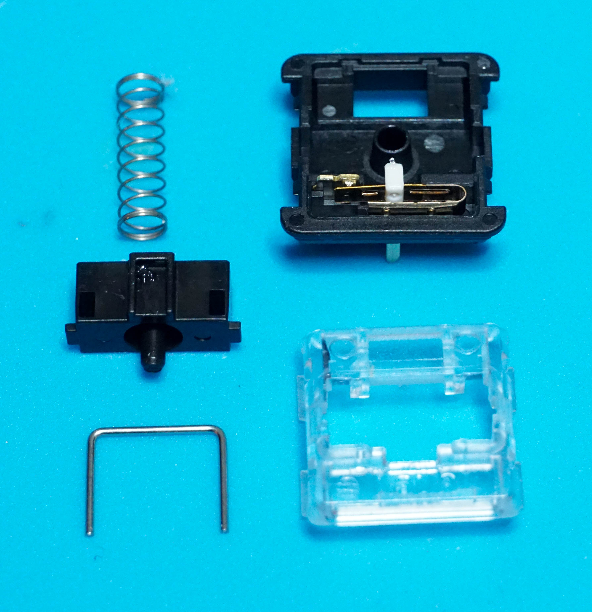

# Choc Low Profile Switch Stabilizer Removal

# Open Switch

Use a small flathead screwdriver or switch opening tool to open the switch

# Remove Stabilizer

The stabilizer is pictured in the bottom left corner of the photo. This can be removed from the switch. There does not seem to be a noticeable change to the feel or stability of the switch, but the stabilizer will no longer rattle around when the keyboard is moved or while typing.