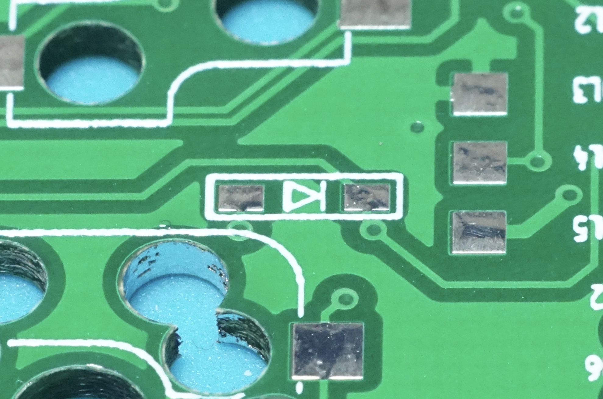
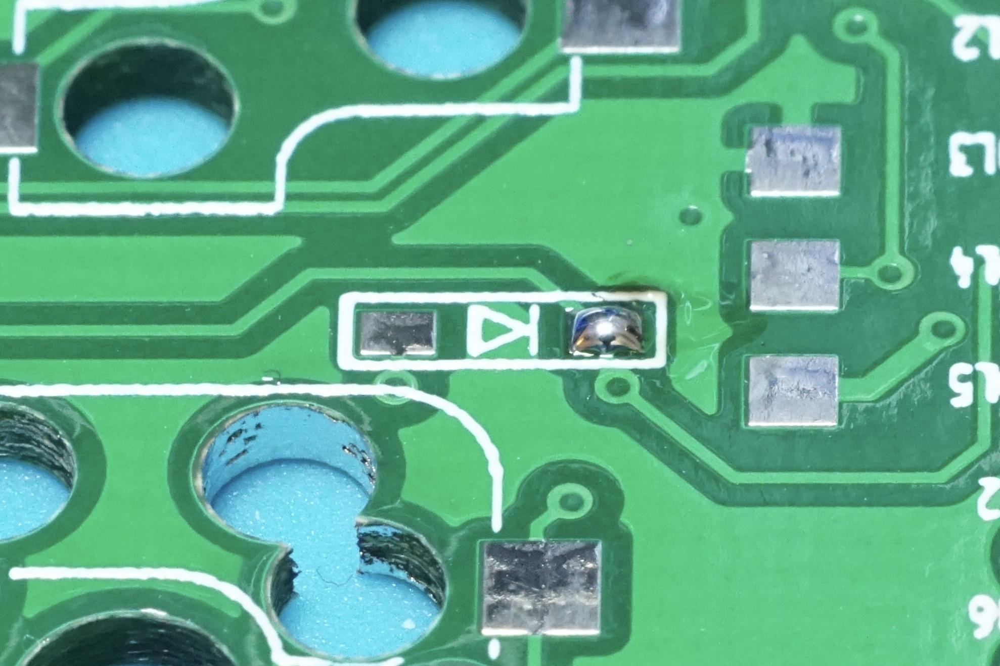
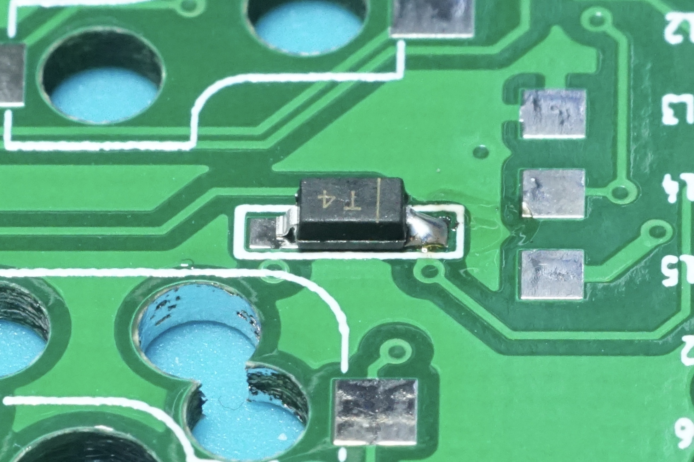
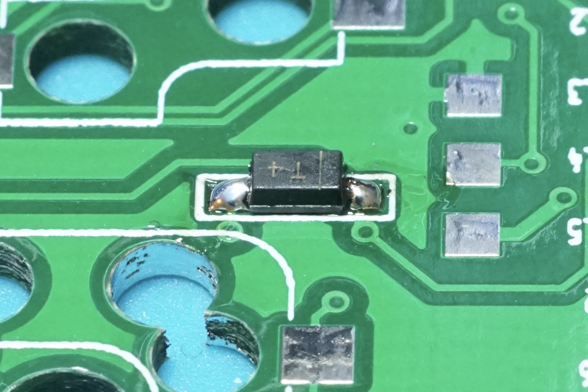

# SMD Soldering Guide

While tedious, assembling a keyboard using surface mount diodes is a great way to improve soldering skills. The steps are very straightforward.

## SMD Footprint

Just like through hole diodes, it is important to make sure that the diodes are soldered in the correct orientation. The footprint specifies the orientation of the diode. In this case, there is an arrow pointing to a line in the footprint. The line on the diode should be placed on the same side as the line on the footprint.

## Add Solder to One Side

Start by adding solder to one of the two pads. Only a small amount is needed.

## Place Diode

Heat the solder with the iron and use tweezers to place the diode onto the footprint. Make sure to orient the diode correctly.

## Finish Soldering Diode

Carefully add solder to the other pad.

